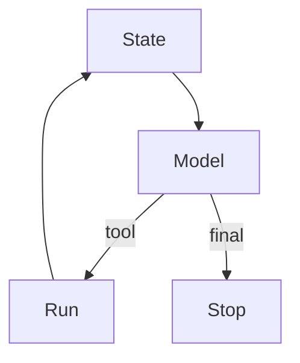

# The agent loop

AI · 20 min

An agent is a loop with state, a model, tools, and a stop. It is not a persona.

## Flow



## The agent loop

The stop is a final answer, a max step count, or a pending human approval. Without a max, a loop bills until you notice. State is the messages and the tool results. Persist it if a person must approve later. The orchestrator in the flagship is this loop.

## Play this

1. Name it
2. Say the rule
3. Tie it to the project or a problem
4. One sentence from memory tomorrow

## Steps

- Read the rule once.
- Write the example from a blank file.
- Say the interview answer out loud.

## Example

```text
max 6 steps, then stop with what you have
```

## The usual miss

A while true around a model call.

## They will ask

What stops the loop?

## Before you close the laptop

Write the max and the three stop reasons.
