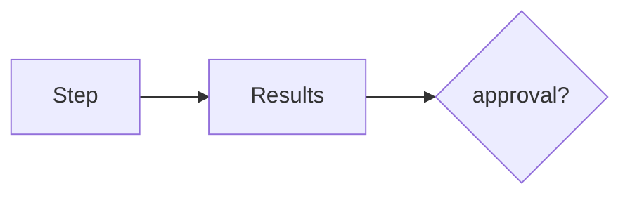

# State

AI · 15 min

State is the step, the tool results, and whether a human is required.

## Flow



## State

A pending proposal is a state. The process can restart and load it. Do not keep that only in a local variable. The states are running, waiting, approved, rejected, done, failed. Illegal jumps are rejected, as in the payment design.

## Play this

1. Name it
2. Say the rule
3. Tie it to the project or a problem
4. One sentence from memory tomorrow

## Steps

- Read the rule once.
- Write the example from a blank file.
- Say the interview answer out loud.

## Example

```text
waiting is the state after propose_scale
```

## The usual miss

State that dies with the process.

## They will ask

What state is a proposal in before a person acts?

## Before you close the laptop

Write the six states.
