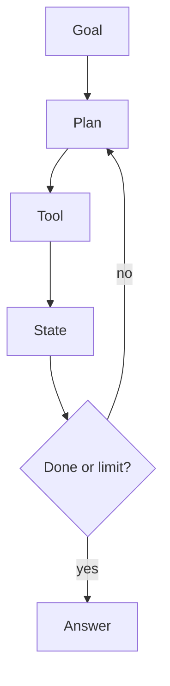

# Agents, MCP, evals, and safety

AI · 40 min

An agent is a loop with tools, state, and a stop condition. MCP is a way to expose tools. Neither removes the need for permissions, traces, and a test set.

## Flow



## Play this

1. Allow-list the tools
2. Cap the steps
3. Trace each call
4. Eval the task not the vibe

## Steps

- State is the messages plus tool results. Memory across sessions is a database, not a hope.
- Timeouts, retries on reads, no retry on an unsafe write.
- Prompt injection: untrusted logs are data, not instructions. The system prompt says so, and the write tool is not available to that call.
- MCP lets a client discover tools. Your policy still decides which tools exist for this user.

## Example

```text
Max 8 tool calls. Then the agent must answer or ask a human.
```

## The usual miss

An agent with a shell tool on a cluster.

## They will ask

How do you make an agent safe enough for production?

## Before you close the laptop

List read tools and write tools for the storage platform. Only the second list needs approval.
