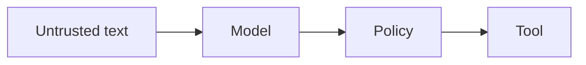

# AI security

AI · 20 min

The incident text is untrusted. The tools are the privilege boundary.

## Flow



## AI security

Treat retrieved text and user text as data, not as instructions your code obeys. The code's allow list is the boundary. Secrets are not in the prompt. The model output is not a shell command. The executor checks approval. That is the security story for a backend interview. It is enough.

## Play this

1. Name it
2. Say the rule
3. Tie it to the project or a problem
4. One sentence from memory tomorrow

## Steps

- Read the rule once.
- Write the example from a blank file.
- Say the interview answer out loud.

## Example

```text
untrusted text, trusted code path
```

## The usual miss

Passing a log line to a shell.

## They will ask

Where is the boundary?

## Before you close the laptop

Point at the allow list.
