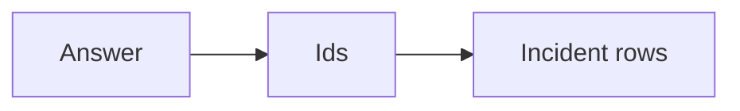

# Citations

AI · 15 min

A citation is an id the user can open. A confident sentence is not a citation.

## Flow



## Citations

The answer lists evidence ids. The API can return the titles. An id that was not retrieved is a failure even if the sentence sounds right. The eval checks the set. This is the difference between a demo and the RCA agent.

## Play this

1. Name it
2. Say the rule
3. Tie it to the project or a problem
4. One sentence from memory tomorrow

## Steps

- Read the rule once.
- Write the example from a blank file.
- Say the interview answer out loud.

## Example

```text
evidence_ids must be a subset of retrieved ids
```

## The usual miss

A citation the model invented.

## They will ask

How do you detect a fake id?

## Before you close the laptop

Assert the subset in the test.
