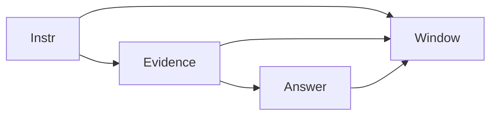

# Context window

AI · 15 min

The window is the budget for instructions, evidence, and the answer together.

## Flow



## Context window

If the sum exceeds the window, the call fails or the model drops the front, depending on the API. You decide what to drop. Evidence ids stay. Decorative instructions go first. The answer needs room too. A window is not memory of last week. That is your database.

## Play this

1. Name it
2. Say the rule
3. Tie it to the project or a problem
4. One sentence from memory tomorrow

## Steps

- Read the rule once.
- Write the example from a blank file.
- Say the interview answer out loud.

## Example

```text
Reserve tokens for the answer. Trim evidence, not the question.
```

## The usual miss

A system prompt the size of a manual.

## They will ask

What do you cut first?

## Before you close the laptop

Write the order: question, evidence, instructions.
