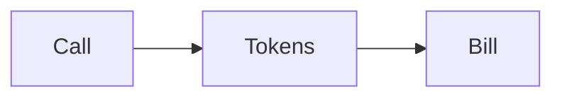

# Cost

AI · 15 min

Tokens in, tokens out, and the number of tool calls. Write them down.

## Flow



## Cost

Log tokens per diagnose. A cap per request stops a loop. The eval run prints the total so a prompt change has a cost, not only a score. You do not need a finance dashboard. You need the number in the README next to the score.

## Play this

1. Name it
2. Say the rule
3. Tie it to the project or a problem
4. One sentence from memory tomorrow

## Steps

- Read the rule once.
- Write the example from a blank file.
- Say the interview answer out loud.

## Example

```text
tokens per question, cap per loop
```

## The usual miss

An uncapped loop and a surprise bill.

## They will ask

What do you log per call?

## Before you close the laptop

Add a counter, even if the model is fake and the count is zero.
