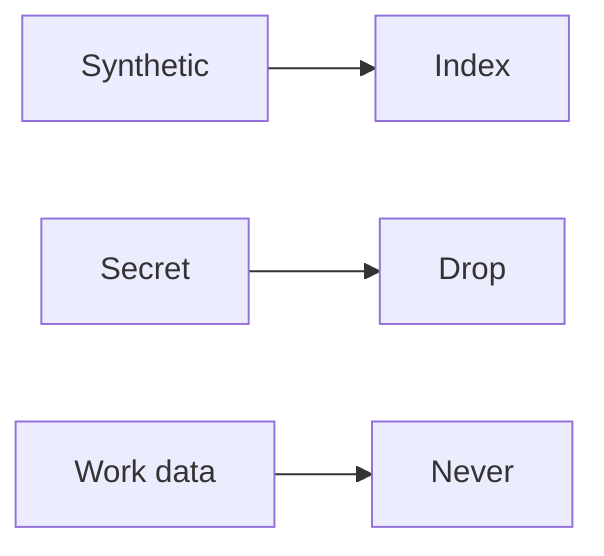

# Data leakage

AI · 15 min

The model should not see secrets, other tenants, or Dell data. The demo uses synthetic incidents.

## Flow



## Data leakage

A filter drops lines that look like keys before embedding and before the prompt. Bucket scope is a filter on retrieval. The repo contains no export from work. Say that in the README so you can say it in the interview.

## Play this

1. Name it
2. Say the rule
3. Tie it to the project or a problem
4. One sentence from memory tomorrow

## Steps

- Read the rule once.
- Write the example from a blank file.
- Say the interview answer out loud.

## Example

```text
synthetic folder only. drop key-shaped lines.
```

## The usual miss

An index built from a work log 'just for the demo'.

## They will ask

What is in the index?

## Before you close the laptop

Write the sentence in the README.
