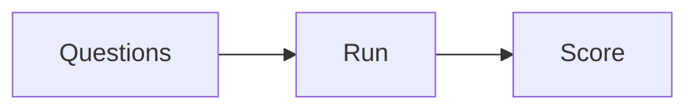

# Evaluation

AI · 25 min

Ten questions with expected ids. A score in the README. That is the December milestone.

## Flow



## Evaluation

Each question has expected incident ids and whether a tool should be called. Pass if the ids match and the forbidden tool was not called. Record failures. Fix one cause: chunking, retrieval, or the prompt. Run again. The number is what you say in the interview, with the failure you fixed.

## Play this

1. Name it
2. Say the rule
3. Tie it to the project or a problem
4. One sentence from memory tomorrow

## Steps

- Read the rule once.
- Write the example from a blank file.
- Say the interview answer out loud.

## Example

```text
10 questions. score = passed / 10. one failure written down.
```

## The usual miss

A vibe check and no set.

## They will ask

What is the score, and what did you change after a miss?

## Before you close the laptop

Create the ten questions, even before the model is wired.
