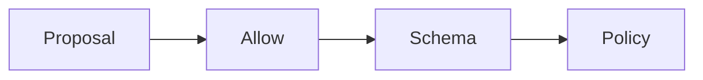

# Guardrails

AI · 20 min

A guardrail is a check your code runs. A sentence in the prompt is not a guardrail.

## Flow



## Guardrails

The allow list, the schema, the approval, and a block on secrets in the tool output. If a log line looks like a key, drop it before it enters the prompt. The model is not asked to behave. The code checks. Prompt injection is why: the incident text can contain instructions, and the code still will not run a tool that is not allowed.

## Play this

1. Name it
2. Say the rule
3. Tie it to the project or a problem
4. One sentence from memory tomorrow

## Steps

- Read the rule once.
- Write the example from a blank file.
- Say the interview answer out loud.

## Example

```text
allow list and schema in code
```

## The usual miss

A system prompt that says 'be safe'.

## They will ask

Name a guardrail that is code.

## Before you close the laptop

List the allow list in the README.
