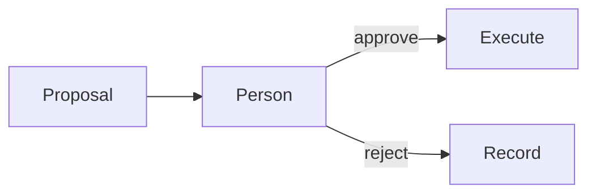

# Human approval

AI · 20 min

The person approves a specific proposal. A general 'the agent is helpful' is not an approval.

## Flow



## Human approval

The proposal stores the tool name, the arguments, and the evidence ids. Approval is a row with the user id and the time. A second click does not run the tool twice. Rejection is recorded. The executor checks the row. This is the January milestone.

## Play this

1. Name it
2. Say the rule
3. Tie it to the project or a problem
4. One sentence from memory tomorrow

## Steps

- Read the rule once.
- Write the example from a blank file.
- Say the interview answer out loud.

## Example

```text
one proposal id, one execution
```

## The usual miss

A chat message that says yes, with no row.

## They will ask

What is stored on the proposal?

## Before you close the laptop

Write the columns.
