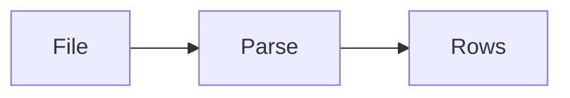

# Document ingestion

AI · 15 min

Ingestion is how a synthetic incident becomes rows your index can read. No Dell data.

## Flow



## Document ingestion

A folder of fake postmortems in the repo. A script reads them, records the incident id, and refuses to run on a path outside that folder. Re-running is idempotent on the incident id. The script is the pipeline's first box.

## Play this

1. Name it
2. Say the rule
3. Tie it to the project or a problem
4. One sentence from memory tomorrow

## Steps

- Read the rule once.
- Write the example from a blank file.
- Say the interview answer out loud.

## Example

```text
incidents/*.md with an id in the header
```

## The usual miss

A script that points at a work directory.

## They will ask

What happens if you run it twice?

## Before you close the laptop

Add one synthetic incident file.
