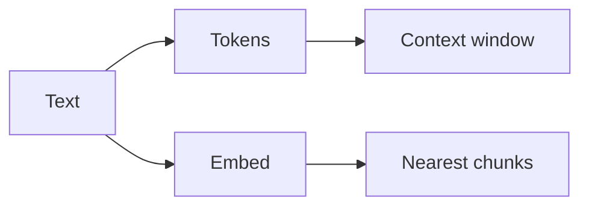

# Tokens, embeddings, retrieval

AI · 30 min

The engineering under the API. You should be able to say why a long log does not fit, and why similar vectors are not the same as a keyword match.

## Flow



## The words you must own

Tokens are the model's units, not words. The context window is the budget for the prompt, the retrieved text, and the answer. Temperature and sampling change variety, not truth. Embeddings place texts in a vector space. Similarity is not a keyword match and not a citation. Structured output is a schema you validate. Tool calling is the model asking your code to run a function you defined. Streaming is how tokens arrive. A long log is chunked because it does not fit.

## Play this

1. Tokens cost money and space
2. Temperature is randomness
3. Embeddings are coordinates
4. Retrieval is nearest chunks

## Steps

- A context window is finite. You retrieve a few chunks instead of pasting the cluster.
- Temperature low for a root-cause draft. Higher only if you want variety, which you usually do not.
- Chunk on headings and size with overlap. Write down why you picked the size.

## Example

```text
Structured output: ask for JSON with cause, evidence, action. Validate it. If it fails, retry once.
```

## The usual miss

Turning the temperature up to make a diagnosis more creative.

## They will ask

Why not send the whole log to the model?

## Before you close the laptop

Count tokens on one synthetic log. Write the number in the README.
