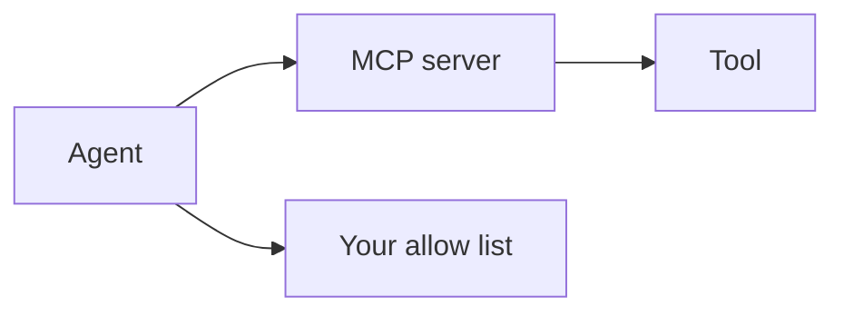

# MCP

AI · 20 min

MCP is a way to expose tools. It does not decide which tool may run.

## Flow



## MCP

You can expose get_metrics through MCP so the same tool is available to more than one client. The approval policy stays in your API. A local stdio server is enough to learn the shape. Do not start here. Start with one function the diagnose route calls. Add MCP when a second client needs the same tool.

## Play this

1. Name it
2. Say the rule
3. Tie it to the project or a problem
4. One sentence from memory tomorrow

## Steps

- Read the rule once.
- Write the example from a blank file.
- Say the interview answer out loud.

## Example

```text
function first, MCP when a second client appears
```

## The usual miss

MCP as the safety model.

## They will ask

What does MCP not replace?

## Before you close the laptop

Say policy versus transport.
