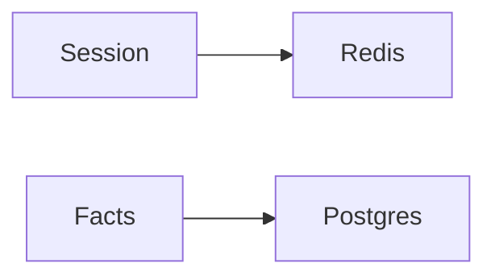

# Memory

AI · 15 min

Memory is state you chose to store. The model does not remember last week.

## Flow



## Memory

Session memory: the current diagnosis, in Redis, with a TTL. Durable memory: incidents in Postgres. Do not stuff the transcript into the prompt forever. Summarize or drop. The approval record is durable and is not memory. It is a row.

## Play this

1. Name it
2. Say the rule
3. Tie it to the project or a problem
4. One sentence from memory tomorrow

## Steps

- Read the rule once.
- Write the example from a blank file.
- Say the interview answer out loud.

## Example

```text
Redis for the session. Postgres for incidents and approvals.
```

## The usual miss

A growing transcript with no bound.

## They will ask

Where does an approval live?

## Before you close the laptop

Name the two stores.
