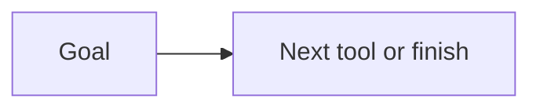

# Planner

AI · 15 min

A planner decides the next tool. It can be the same model with a schema, not a second product.

## Flow



## Planner

For this project the plan is short: metrics, then logs, then traces, then a cause. A free-form planner is optional. A fixed order is easier to test and is honest. If you add a planner, the eval includes a case where the right action is to stop.

## Play this

1. Name it
2. Say the rule
3. Tie it to the project or a problem
4. One sentence from memory tomorrow

## Steps

- Read the rule once.
- Write the example from a blank file.
- Say the interview answer out loud.

## Example

```text
fixed order for version one
```

## The usual miss

A planner framework before one tool works.

## They will ask

What is the next step for a latency question?

## Before you close the laptop

Write the order of three reads.
