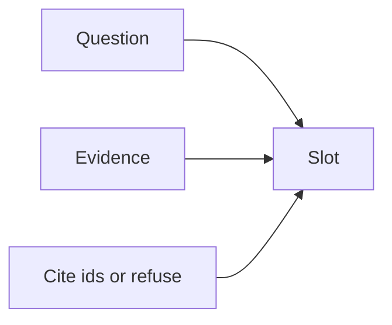

# Prompt and context

AI · 20 min

The prompt is a template with slots. The slots are the question, the evidence, and the rule to cite ids.

## Flow



## Prompt and context

The rule: use only the evidence, cite ids, and say you do not know when the evidence is empty. The template is in the repo, not hidden in a notebook. A change to the template is a change you re-run the eval for.

## Play this

1. Name it
2. Say the rule
3. Tie it to the project or a problem
4. One sentence from memory tomorrow

## Steps

- Read the rule once.
- Write the example from a blank file.
- Say the interview answer out loud.

## Example

```text
system: cite ids. user: question plus evidence blocks.
```

## The usual miss

A prompt you edit in the console and never save.

## They will ask

What do you send when retrieval is empty?

## Before you close the laptop

Put the template in the repo.
