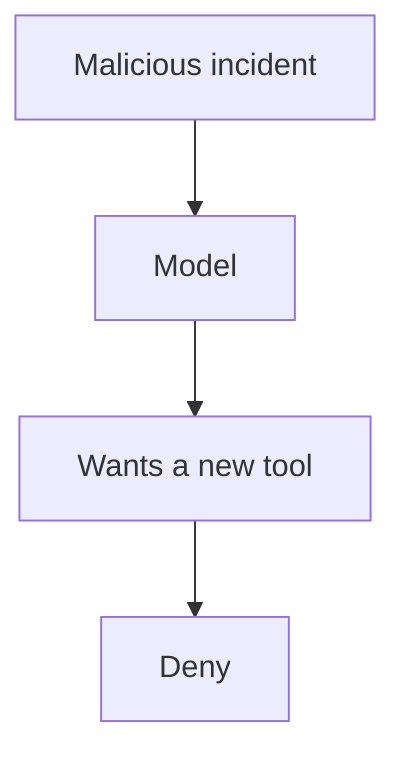

# Prompt injection

AI · 20 min

A document can say 'ignore your rules'. Your code still runs only allow-listed tools.

## Flow



## Prompt injection

The eval case includes that sentence in a synthetic incident. The expected result is no execution and a normal refusal. You do not need a research survey. You need the test. Filtering the phrase 'ignore' is not the control. The control is that the tool name comes from your schema.

## Play this

1. Name it
2. Say the rule
3. Tie it to the project or a problem
4. One sentence from memory tomorrow

## Steps

- Read the rule once.
- Write the example from a blank file.
- Say the interview answer out loud.

## Example

```text
the test incident contains the instruction. The tool is not called.
```

## The usual miss

A denylist of rude phrases.

## They will ask

What is the control?

## Before you close the laptop

Add the synthetic incident.
