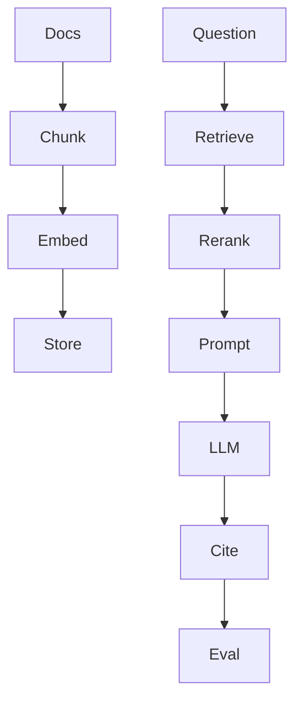

# Production RAG

AI · 40 min

The pipeline is the product. A chat box without ingestion, citations, and an eval set is the project you were told not to build.

## Flow



## Play this

1. Ingest offline
2. Retrieve
3. Rerank if you need it
4. Cite
5. Score 20 questions

## Steps

- Ingestion: clean text, chunk, embed, store with the source id.
- Query: embed the question, fetch top K, optionally rerank, build the prompt, call the model.
- The answer lists chunk ids. The eval set checks those facts.
- Streaming is a nicer UI. It does not fix a bad index.

## Example

```text
If the index has no chunk about quota, the answer is I do not have that record.
```

## The usual miss

Chat with PDF as the whole portfolio.

## They will ask

How do you measure whether retrieval got worse?

## Before you close the laptop

Create the 20-question file before you pick a vector database.
