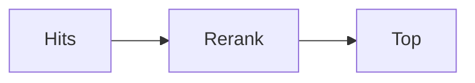

# Reranking

AI · 15 min

A reranker reorders the hits with a slower, sharper model. It is optional and it is how you spend rank quality.

## Flow



## Reranking

Retrieve 20, rerank, keep 4. If you have no reranker, a lexical check on the bucket id is still a second pass. Say which you use. Do not claim a reranker you did not run. The eval score tells you if the extra step earned its latency.

## Play this

1. Name it
2. Say the rule
3. Tie it to the project or a problem
4. One sentence from memory tomorrow

## Steps

- Read the rule once.
- Write the example from a blank file.
- Say the interview answer out loud.

## Example

```text
20 then 4
```

## The usual miss

Reranking a hundred hits on the request path with no budget.

## They will ask

What does the reranker see?

## Before you close the laptop

Decide 20 and 4, or say you skip it and why.
