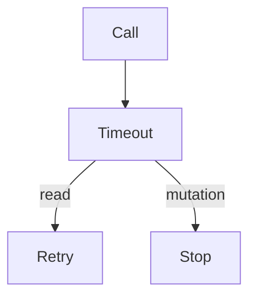

# Retries and timeouts

AI · 15 min

Every tool call has a timeout. Retries are for reads.

## Flow



## Retries and timeouts

Two seconds for metrics, longer only if you measured. Two retries for a GET. A mutation is not retried unless the idempotency key is in the call and the approval still holds. The loop stops on timeout and says the tool did not answer. It does not invent the metric.

## Play this

1. Name it
2. Say the rule
3. Tie it to the project or a problem
4. One sentence from memory tomorrow

## Steps

- Read the rule once.
- Write the example from a blank file.
- Say the interview answer out loud.

## Example

```text
GET retry 2. POST no retry without a key.
```

## The usual miss

Retrying a scale call.

## They will ask

Which tool may retry?

## Before you close the laptop

Write the two numbers.
