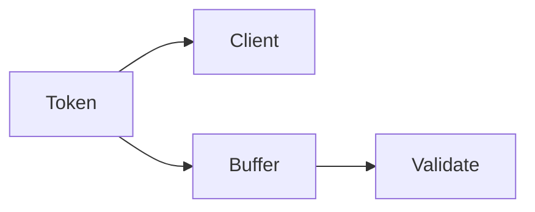

# Streaming

AI · 10 min

Streaming sends tokens as they are ready. The user sees progress. You still validate the final object if you required a schema.

## Flow



## Streaming

Stream a narrative. Buffer a JSON answer and validate at the end. A half-streamed tool call is not executed. If the client disconnects, cancel the upstream call so you stop paying.

## Play this

1. Name it
2. Say the rule
3. Tie it to the project or a problem
4. One sentence from memory tomorrow

## Steps

- Read the rule once.
- Write the example from a blank file.
- Say the interview answer out loud.

## Example

```text
stream text, buffer JSON
```

## The usual miss

Executing a tool from a partial stream.

## They will ask

When do you validate?

## Before you close the laptop

Say which response is streamed.
