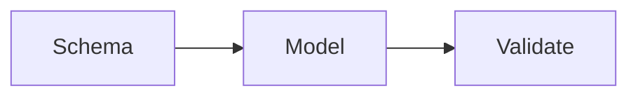

# Structured output

AI · 20 min

Ask for a schema. Validate it. A paragraph you parse with a regex will break.

## Flow



## Structured output

The diagnosis schema is cause, evidence ids, and a recommended action that is one of a fixed set. If validation fails, retry once or return an error. Do not show the broken JSON to the user. The tool call is a kind of structured output. The same rule applies: the name must be on the allow list.

## Play this

1. Name it
2. Say the rule
3. Tie it to the project or a problem
4. One sentence from memory tomorrow

## Steps

- Read the rule once.
- Write the example from a blank file.
- Say the interview answer out loud.

## Example

```text
{cause, evidence_ids, action}
```

## The usual miss

Splitting on newlines and hoping.

## They will ask

What do you do when the JSON is invalid?

## Before you close the laptop

Write the three fields.
