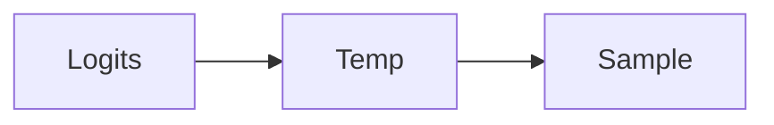

# Temperature and sampling

AI · 15 min

Temperature changes variety. It does not change whether a citation is true.

## Flow



## Temperature and sampling

Zero, or near it, for a diagnosis you want stable. Higher when you are brainstorming names and will throw the result away. Top-p is another cut on the same distribution. The eval set should use the same temperature as production or the score lies. A safer diagnosis is retrieval and a schema, not a lower temperature alone.

## Play this

1. Name it
2. Say the rule
3. Tie it to the project or a problem
4. One sentence from memory tomorrow

## Steps

- Read the rule once.
- Write the example from a blank file.
- Say the interview answer out loud.

## Example

```text
temperature 0 for the diagnose route
```

## The usual miss

Turning temperature down and skipping the eval.

## They will ask

What does temperature not fix?

## Before you close the laptop

Set it in the client and in the README.
