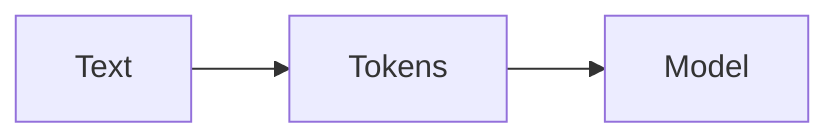

# Tokens

AI · 15 min

Tokens are the unit the model reads and the unit you pay for. They are not words.

## Flow



## Tokens

A word can be several tokens. Code and ids tokenize worse than prose. You budget the prompt in tokens. A log pasted whole will not fit, and it will cost if it does. Say 'tokens' when you talk about length. The eval set records token counts so a change in the prompt is visible.

## Play this

1. Name it
2. Say the rule
3. Tie it to the project or a problem
4. One sentence from memory tomorrow

## Steps

- Read the rule once.
- Write the example from a blank file.
- Say the interview answer out loud.

## Example

```text
Count tokens before you call. Truncate with a rule, not with hope.
```

## The usual miss

Assuming one word is one token.

## They will ask

Why did a short-looking log not fit?

## Before you close the laptop

Note the budget: prompt, evidence, answer.
