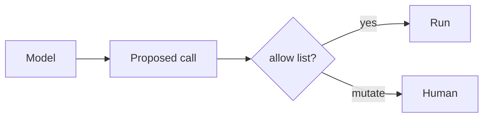

# Tool calling

AI · 25 min

The model names a tool and arguments. Your code decides whether to run it.

## Flow



## Tool calling

Tools: get metrics, get logs, get trace, propose scale. The first three are reads. The last one is a proposal, not a scale. Arguments are validated. A timeout wraps the call. The result goes back into the loop. The model does not hold credentials. The Java API does.

## Play this

1. Name it
2. Say the rule
3. Tie it to the project or a problem
4. One sentence from memory tomorrow

## Steps

- Read the rule once.
- Write the example from a blank file.
- Say the interview answer out loud.

## Example

```text
propose_scale is stored as pending. It does not call the cluster.
```

## The usual miss

A tool named run_shell.

## They will ask

Which tools are reads?

## Before you close the laptop

List three tools and the one that needs a person.
