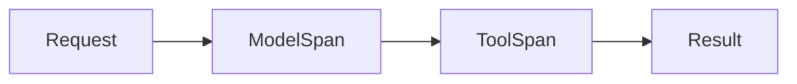

# Tracing an agent

AI · 15 min

Each step is a span: model, tool, and approval. The trace is the audit.

## Flow



## Tracing an agent

A trace id on the proposal. Child spans for tools with the arguments minus secrets. You can answer 'why did it recommend a scale' by opening the trace. Cost in tokens can be an attribute on the model span. This is the observability lesson applied to the loop.

## Play this

1. Name it
2. Say the rule
3. Tie it to the project or a problem
4. One sentence from memory tomorrow

## Steps

- Read the rule once.
- Write the example from a blank file.
- Say the interview answer out loud.

## Example

```text
trace id on the proposal and on the tool log
```

## The usual miss

A log line that says 'agent ran' and nothing else.

## They will ask

How do you explain a recommendation a week later?

## Before you close the laptop

Put the trace id on the proposal.
