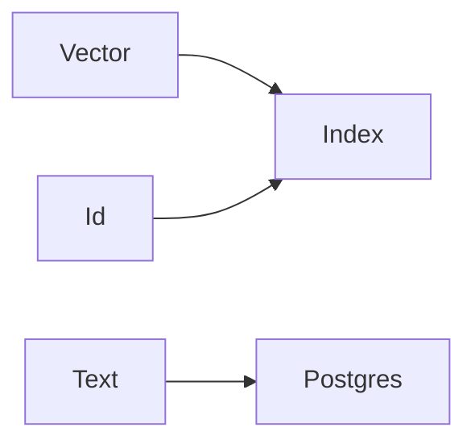

# Vector store

AI · 15 min

The store holds vectors and ids. It is not the source of the incident text if you can keep the text in Postgres.

## Flow



## Vector store

Pick one local store so the demo runs without an account. Store the id and the vector. The text can live with the vector for the demo if you say the source is still the file or the row. Rebuild from the files is possible. That rebuild is your recovery.

## Play this

1. Name it
2. Say the rule
3. Tie it to the project or a problem
4. One sentence from memory tomorrow

## Steps

- Read the rule once.
- Write the example from a blank file.
- Say the interview answer out loud.

## Example

```text
id + vector, rebuild from the folder
```

## The usual miss

A store you cannot rebuild.

## They will ask

How do you recover the index?

## Before you close the laptop

Write rebuild in the README.
