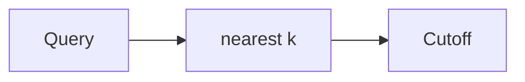

# Vector similarity

AI · 15 min

Similarity is a score. You still decide the cutoff and you still rerank.

## Flow



## Vector similarity

Cosine or dot product, whichever the index uses. A high score can still be the wrong incident. Retrieve more than you will show, then rerank or filter by bucket. A empty result is an answer: I do not have that. Do not fill the silence with a fluent guess.

## Play this

1. Name it
2. Say the rule
3. Tie it to the project or a problem
4. One sentence from memory tomorrow

## Steps

- Read the rule once.
- Write the example from a blank file.
- Say the interview answer out loud.

## Example

```text
k = 8, keep 3 after the cutoff
```

## The usual miss

Taking the single nearest neighbor as truth.

## They will ask

What do you do when nothing is close?

## Before you close the laptop

Set k and the empty behavior.
