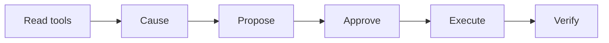

# Workflow

AI · 15 min

A workflow is the allowed order. Latency diagnosis is not the same workflow as a scale action.

## Flow



## Workflow

Reads can run without a person. The mutation is a different workflow with a gate. Writing this down stops the agent from calling scale in the middle of a diagnosis because the model felt confident. The flagship README shows the picture.

## Play this

1. Name it
2. Say the rule
3. Tie it to the project or a problem
4. One sentence from memory tomorrow

## Steps

- Read the rule once.
- Write the example from a blank file.
- Say the interview answer out loud.

## Example

```text
reads, then propose, then a person, then verify
```

## The usual miss

One loop that can call every tool.

## They will ask

Where is the gate?

## Before you close the laptop

Put the picture in the README.
