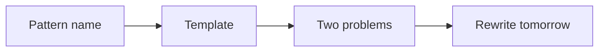

# 25 Sep to 25 Oct — retrieval and Python syntax

Calendar · 2.5 hr

Phase 1 rebuilds the patterns you forget: arrays, hashing, two pointers, sliding window, binary search, linked lists. Java side is collections, HashMap, equality, streams, and concurrency vocabulary. Python is syntax through requests.

## Flow




## Play this

1. Identify the pattern before coding
2. Rewrite yesterday with the file empty
3. One Python function, not a course module
4. Stop at 2.5 hours

## Steps

- Use the Patterns page. Two or three problems per shape.
- Sliding window is one machine: expand right, update state, shrink left, record the answer. Fruit baskets and minimum window are variations.
- HashMap: buckets, equals and hashCode, and what happens on collision. Say it once from memory.

## Example

```text
A green mark means you rewrote it alone. A red mark comes back. Day 1, 3, 7, 15, 30.
```

## The usual miss

Watching the solution and ticking completed.

## They will ask

Is this a new pattern or a variation?

## Before you close the laptop

Tonight: Two Sum from a blank file, then say which line updates the map.
