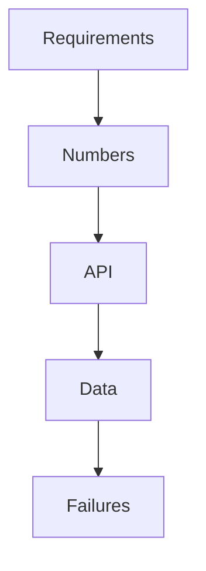

# 26 Oct to 25 Nov — core structures and four designs

Calendar · 2.5 hr

Stacks, monotonic stacks, intervals, greedy, trees, BST, heaps. Spring moves from annotations you use to transactions, JPA, Redis, and Kafka failure. Designs: URL shortener, rate limiter, notification service, file storage.

## Flow




## Play this

1. One design, 40 minutes, no video first
2. Kafka question is why, not the dependency
3. Tree DFS returns a summary
4. Heap of size K

## Steps

- Transaction propagation and isolation. Know why a private self-call skips the proxy.
- N+1: one query becomes one per row. Fix with a fetch join or a batch, and say the cost.
- Rate limiter: token bucket, where the counters live, what happens when Redis is down.

## Example

```text
Design out loud before drawing. The picture is the notes, not the thinking.
```

## The usual miss

Starting the video at minute zero.

## They will ask

Where does the rate-limit state live with twenty servers?

## Before you close the laptop

Speak a rate limiter for 10 minutes into a voice note. Listen once.
