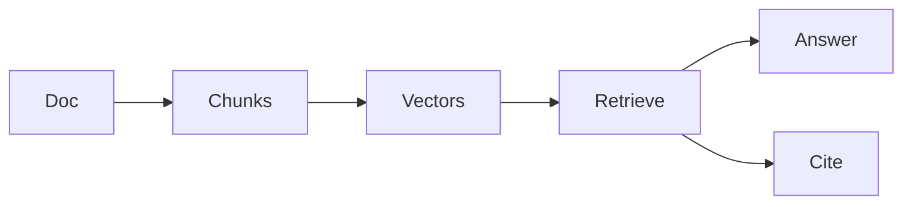

# 26 Nov to 20 Dec — graphs, cloud, RAG

Calendar · 2.5 hr

Graphs through Dijkstra and basic DP. Cloud is IAM, VPC, a real deploy path, Docker, and Kubernetes objects you can debug. AI is tokens, embeddings, a RAG pipeline, and one tool call.

## Flow



## Play this

1. BFS is unweighted distance
2. Dijkstra is non-negative weights
3. VPC before EKS
4. RAG cites or it is a demo

## Steps

- Basic DP only: climbing stairs, house robber, subset sum, coin change, one grid. Advanced MCM waits.
- Deploy the order or diagnostics service in Docker. Then the same image behind a Kubernetes Deployment and Service.
- Python FastAPI endpoint that returns chunks for a question. Keyword overlap is allowed on day one. Embeddings replace it the next week.

## Example

```text
January interviews do not require Kosaraju, bridges, or a perfect Z-algorithm. Those stay in the later pile.
```

## The usual miss

Starting EKS before you can explain a subnet.

## They will ask

Why is this graph BFS and not Dijkstra?

## Before you close the laptop

Draw your VPC on paper: two subnets, one load balancer, one database not on the public internet.
