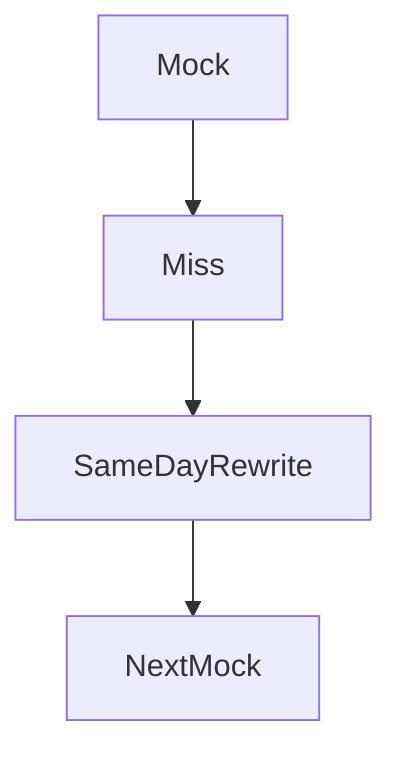

# 21 Dec to 15 Jan — mocks, not new syllabi

Calendar · 2.5 hr

Mixed retrieval. Five to eight full designs. The flagship README is the project story. Mocks cover Java, Spring, DSA, LLD, HLD, the project, and a behavioral story with a number.

## Flow




## Play this

1. No new pattern family
2. Rewrite the miss the same day
3. Project demo in 8 minutes
4. Resume matches what you can draw

## Steps

- Resume line: backend, distributed systems, AI, cloud. Each bullet has a number you can defend.
- Behavioral set: five STAR stories, 90 seconds, including one agent you shipped and one incident.
- Selective applications start in January. Referrals where you actually know the person.

## Example

```text
You joined Dell in April 2026. The one-year mark is April 2027. January is for loops that can land an offer around that window, not for a surprise resignation in October.
```

## The usual miss

Waiting until you feel 100 percent ready.

## They will ask

What did yesterday’s mock miss, and did you rewrite it?

## Before you close the laptop

Book one mock with a friend or a recording. Listen for the pattern name arriving late.
