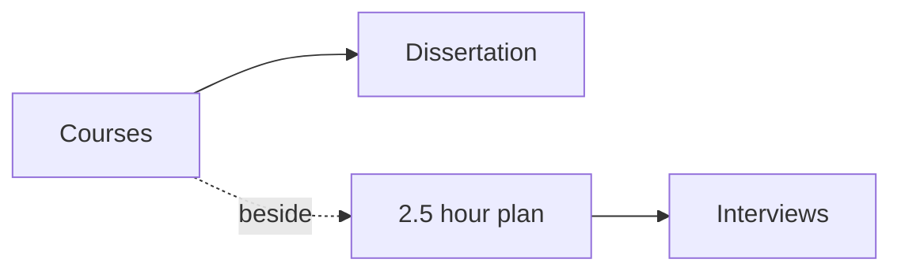

# BITS M.Tech AI and ML, as a side degree

Career · 15 min

The degree matches the direction. It does not replace the January interviews.

## Flow



## BITS M.Tech AI and ML, as a side degree

The programme is 12 courses plus a dissertation. The public list includes agentic systems, large language models, cloud-native AI, MLOps, distributed ML, software engineering for ML, NLP, deep learning, data management, and parallel programming. The fee quoted on the pages is about ₹3.34 lakh across four semesters. It does not place you. Deadlines on the public pages have disagreed. Confirm the live date before you pay. If the week's assignment collides with a mock, the mock wins.

## Play this

1. Name it
2. Say the rule
3. Tie it to the project or a problem
4. One sentence from memory tomorrow

## Steps

- Read the rule once.
- Write the example from a blank file.
- Say the interview answer out loud.

## Example

```text
12 courses, a dissertation, beside the job, not instead of DSA.
```

## The usual miss

Enrolling and skipping the blank rewrites.

## They will ask

What does the degree not do in April?

## Before you close the laptop

Check the live deadline once, then decide.
