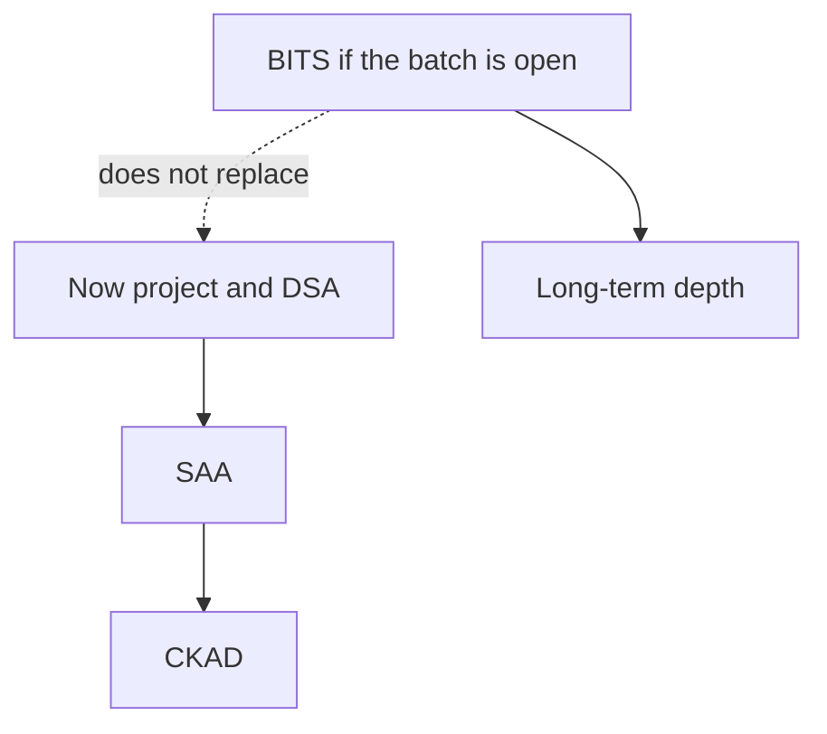

# SAA, CKAD, and BITS on the side

Career · 20 min

Two credentials earn a place: AWS Solutions Architect Associate after you can draw the VPC, and CKAD after you can debug a pod. BITS M.Tech AI and ML is a degree for the next two years, including marriage and a job, not the thing that gets you the January interview.

## Flow




## Play this

1. SAA after a real diagram
2. CKAD after CrashLoop practice
3. AI-901 optional
4. BITS is parallel

## Steps

- Skip Cloud Practitioner, AI-900, LangChain badges, and Python completion certificates.
- AI-901 replaced the English AI-900 exam in 2026. It is still optional.
- AWS Generative AI Developer Professional is the later GenAI credential, after Bedrock or an equivalent pipeline is something you operated.
- BITS WILP M.Tech AI and ML lists agentic systems, LLMs, cloud-native AI, and a dissertation. Public pages have quoted about ₹3.34 lakh across four semesters and have shown conflicting 2026 deadlines. It does not place you. If you join the October batch, confirm the date and the fee on the BITS site before you pay. It runs beside the job. It does not eat the 2.5 hours.

## Example

```text
If the degree load collides with a mock week, the mock wins.
```

## The usual miss

Enrolling and then skipping DSA because the degree feels like progress.

## They will ask

What does BITS not do for the April switch?

## Before you close the laptop

Email or check the BITS page for the live deadline. Do it once, then decide.
