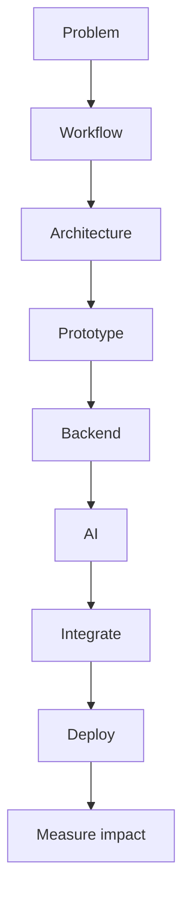

# Forward deployed engineering

Career · 20 min

FDE is a customer problem carried through to a measured production change. It is an optional track, not a replacement for the Java profile.

## Flow



## Forward deployed engineering

The posts ask for Python, agents, RAG, cloud, and the ability to sit with a workflow. Your Dell agents are adjacent experience. The flagship is the public proof: a problem, a design, a backend, a gated tool, and an eval number. Customer communication is the part a repo cannot fake. You practice it by writing the problem statement in the README as a user would say it. You do not switch your identity to 'AI fresher' to chase the title.

## Play this

1. Name it
2. Say the rule
3. Tie it to the project or a problem
4. One sentence from memory tomorrow

## Steps

- Read the rule once.
- Write the example from a blank file.
- Say the interview answer out loud.

## Example

```text
Problem statement in the README, then the architecture, then the score.
```

## The usual miss

A chatbot with no workflow and no number.

## They will ask

What is the user problem in one sentence?

## Before you close the laptop

Write that sentence at the top of the README.
