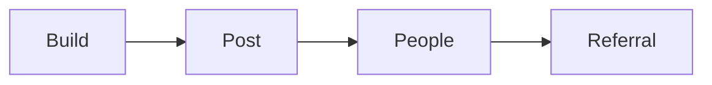

# One post, a short list of people

Career · 15 min

Networking is a weekly quota, not a persona. One technical post and a handful of real conversations beat a daily influencer schedule.

## Flow




## Play this

1. One post a week
2. Five engineers
3. Two recruiters
4. Two people at target companies

## Steps

- Post from the work you did that week: an idempotent consumer, a probe you broke, a RAG eval number.
- No Dell internals. The synthetic platform is the public story.
- Ask for a referral only after a specific conversation, not as the first message.

## Example

```text
This week I made a consumer safe to run twice. Here is the key, and here is the test.
```

## The usual miss

Posting motivation quotes.

## They will ask

Who did you talk to, and about which system?

## Before you close the laptop

Draft the first post from the outbox sketch. Four sentences.
