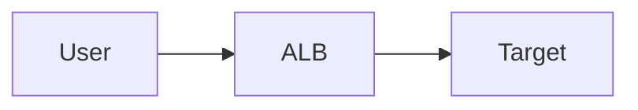

# ALB

Cloud · 15 min

The application load balancer routes HTTP and removes unhealthy targets.

## Flow



## ALB

Listeners, target groups, health checks. Three failures and the target is out. It returns when health passes. Path rules can split the Java API and the Python agent. Sticky sessions are a smell. Put session state in Redis.

## Play this

1. Name it
2. Say the rule
3. Tie it to the project or a problem
4. One sentence from memory tomorrow

## Steps

- Read the rule once.
- Write the example from a blank file.
- Say the interview answer out loud.

## Example

```text
GET /actuator/health
```

## The usual miss

Balancing to a target that is up and not ready.

## They will ask

What takes a target out of rotation?

## Before you close the laptop

Write the health path.
