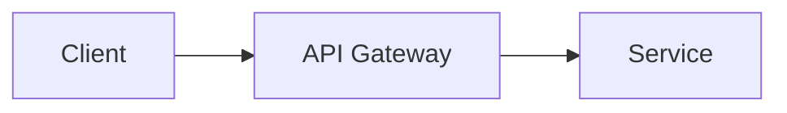

# API Gateway

Cloud · 15 min

API Gateway is a front door with auth and throttles. An ALB is enough until you need those.

## Flow



## API Gateway

Use it for a public edge with API keys or JWT authorizers and a throttle. The project's Java API sits behind the ALB. Add Gateway when a partner calls a narrow API. Two front doors on day one split your head.

## Play this

1. Name it
2. Say the rule
3. Tie it to the project or a problem
4. One sentence from memory tomorrow

## Steps

- Read the rule once.
- Write the example from a blank file.
- Say the interview answer out loud.

## Example

```text
ALB now. Gateway when a partner needs a key.
```

## The usual miss

Three ways to reach the same route.

## They will ask

Why is the ALB enough for version one?

## Before you close the laptop

One sentence.
