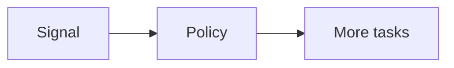

# Auto Scaling

Cloud · 15 min

Add capacity from a signal that matches the bottleneck.

## Flow



## Auto Scaling

CPU is the wrong signal when the pool is waiting on Postgres. Queue depth or consumer lag is the signal for workers. Request count fits the API. A scale-in cooldown stops you from flapping. The minimum is one for a demo and two when you care about a restart.

## Play this

1. Name it
2. Say the rule
3. Tie it to the project or a problem
4. One sentence from memory tomorrow

## Steps

- Read the rule once.
- Write the example from a blank file.
- Say the interview answer out loud.

## Example

```text
Scale the consumer on lag, not CPU.
```

## The usual miss

Scaling the API when the database is the ceiling.

## They will ask

What signal adds a worker?

## Before you close the laptop

Name the metric.
