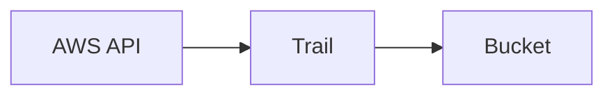

# CloudTrail

Cloud · 15 min

CloudTrail is the account's audit log. Who called which API.

## Flow



## CloudTrail

Turn it on for the account. Store it in a bucket the app cannot delete. When a security group changes, Trail is how you answer who. The agent's tool calls that use AWS will appear here. That is a feature. You do not disable it to hide a demo.

## Play this

1. Name it
2. Say the rule
3. Tie it to the project or a problem
4. One sentence from memory tomorrow

## Steps

- Read the rule once.
- Write the example from a blank file.
- Say the interview answer out loud.

## Example

```text
Trail to a locked bucket.
```

## The usual miss

A trail the executor role can delete.

## They will ask

Who changed the security group?

## Before you close the laptop

Say Trail, not 'the logs'.
