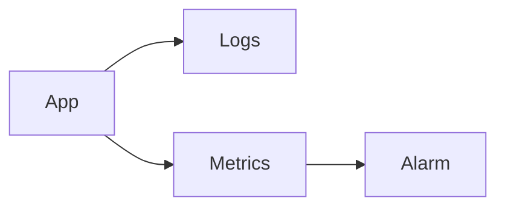

# CloudWatch

Cloud · 15 min

CloudWatch holds metrics, logs, and alarms.

## Flow



## CloudWatch

A log group per service. A metric filter only if you must. An alarm on error rate and on the 80 percent disk forecast's input. Dashboards are for you. The agent queries the same metrics. Retention costs money. Keep debug short.

## Play this

1. Name it
2. Say the rule
3. Tie it to the project or a problem
4. One sentence from memory tomorrow

## Steps

- Read the rule once.
- Write the example from a blank file.
- Say the interview answer out loud.

## Example

```text
Alarm on 5xx rate. Log retention 14 days.
```

## The usual miss

An alarm on a single log line with no action.

## They will ask

What pages a human?

## Before you close the laptop

Write one alarm.
