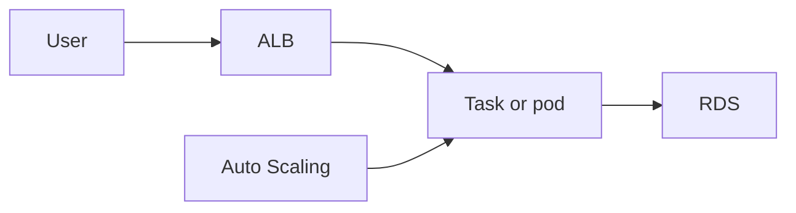

# EC2, ALB, autoscaling, ECS, EKS

Cloud · 35 min

Compute is where the process runs. You pick it after you know the network, not before.

## Flow



## The path of a request

DNS names the ALB. The ALB is in public subnets. The target is a pod or task in private subnets. The security group on the target allows the app port only from the ALB's security group. The target calls RDS on 5432, and RDS allows that security group. If you can draw those four boxes, you can answer most of the compute section of an SAA-style question.

## ECS or EKS

ECS is the smaller operational surface. EKS is the one that matches CKAD and your OpenShift work. Pick EKS for the flagship so the story stays one story. Say the trade: you operate more of Kubernetes, and you keep the skills the backend roles asked for.

## Play this

1. ALB checks health
2. Scale on a signal
3. ECS is tasks
4. EKS is Kubernetes

## Steps

- EC2 is a virtual machine. You patch it. A private subnet holds the app. A public subnet holds the load balancer.
- An ALB routes HTTP and checks a health path. Unhealthy targets leave rotation.
- Auto Scaling adds instances from a signal: CPU, request count, or queue depth. Queue depth is the honest signal for workers.
- ECS runs containers without you managing the control plane. EKS is Kubernetes. Use EKS if the interview story is the Kubernetes one you are already learning. Do not run both for the project.

## Example

```text
Health check: GET /actuator/health
Unhealthy for three checks, then the target is out.
The pod or task restarts. The ALB does not send it traffic until it is healthy.
```

## The usual miss

Scaling on CPU while the bottleneck is a full connection pool.

## They will ask

Why would you scale the consumer on queue lag instead of CPU?

## Before you close the laptop

Write the health path and the one metric that should add a worker.
