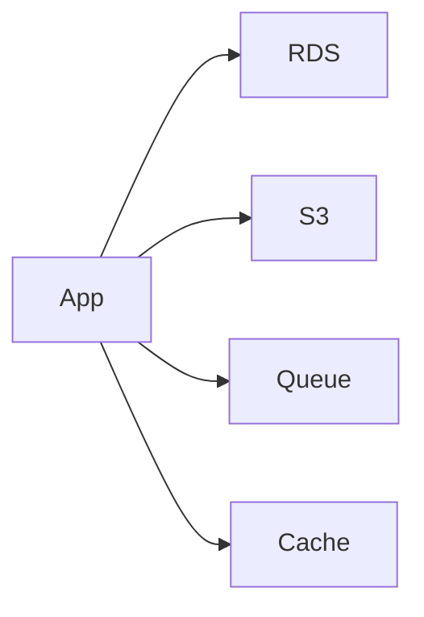

# S3, RDS, queues, and cache

Cloud · 35 min

The flagship maps cleanly: bytes in S3, metadata in RDS, events on SQS or Kafka, hot state in ElastiCache.

## Flow



## Which store

S3 holds bytes: synthetic objects, log batches. It is durable and the request pays per call. RDS Postgres holds metadata and the outbox, with transactions. DynamoDB is for a key-value access pattern with a scale you can explain. Do not add it beside Postgres without a reason. ElastiCache is Redis. SQS is the simple queue. The project uses Kafka for the replayable log and can use SQS where replay does not matter.

## Play this

1. S3 is objects
2. RDS is Postgres
3. SQS is a buffer
4. ElastiCache is Redis

## Steps

- S3: bucket, key, storage class, lifecycle, pre-signed URL. Not a filesystem you mount and forget.
- RDS Postgres for the source of truth. Multi-AZ is availability, not a write-scaling strategy.
- SQS for a simple buffer. Kafka when you need replay and several consumers. Say the difference.
- ElastiCache Redis for the rate limit and the cache. Same rules as the Redis topic.

## Example

```text
A pre-signed URL expires. The client uploads directly. Your API stays small.
```

## The usual miss

Using SQS and also expecting to rewind the stream a week later.

## They will ask

When do you pick SQS over Kafka?

## Before you close the laptop

Label the four boxes on the flagship diagram with the AWS name.
