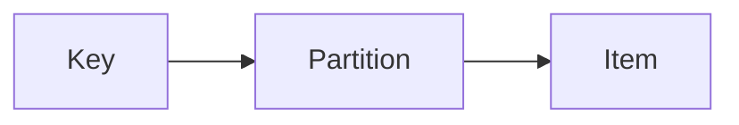

# DynamoDB

Cloud · 15 min

DynamoDB is a key-value and document store with a partition key you must design. You do not add it beside Postgres without a reason.

## Flow



## DynamoDB

The partition key decides spread and the query you can do. A hot key is a hot partition. Single-digit millisecond reads at scale are the reason to choose it. The project does not need it for the outbox, because the outbox needs a transaction with the business row. Say that refusal. It is a stronger answer than a second database.

## Play this

1. Name it
2. Say the rule
3. Tie it to the project or a problem
4. One sentence from memory tomorrow

## Steps

- Read the rule once.
- Write the example from a blank file.
- Say the interview answer out loud.

## Example

```text
Postgres for the transactional row. Dynamo only for a pure key lookup you can justify.
```

## The usual miss

A table whose access pattern you cannot state.

## They will ask

Why is the outbox not in DynamoDB?

## Before you close the laptop

Say the sentence.
