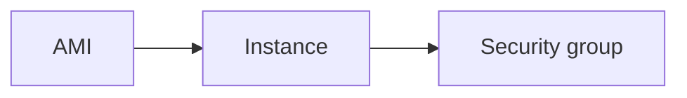

# EC2

Cloud · 15 min

EC2 is a virtual machine. You patch it. Prefer a task or a pod unless you need the machine.

## Flow



## EC2

An instance has an AMI, a type, a subnet, and a role. User data is a script, not a configuration system. SSH from your laptop is a break-glass path, not the deploy. The project runs containers. EC2 is what the cluster nodes are, and you say that.

## Play this

1. Name it
2. Say the rule
3. Tie it to the project or a problem
4. One sentence from memory tomorrow

## Steps

- Read the rule once.
- Write the example from a blank file.
- Say the interview answer out loud.

## Example

```text
The node is EC2. The app is a pod.
```

## The usual miss

Hand-building one VM and calling it the design.

## They will ask

When would you still choose a single instance?

## Before you close the laptop

One sentence: the app is not an SSH session.
