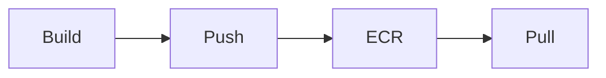

# ECR

Cloud · 10 min

ECR stores the image the cluster pulls.

## Flow



## ECR

Tag the image with the git sha. Pin that tag in the Deployment. Scan on push. The repository is private. The node role can pull. Your laptop role can push. Latest is not a pin.

## Play this

1. Name it
2. Say the rule
3. Tie it to the project or a problem
4. One sentence from memory tomorrow

## Steps

- Read the rule once.
- Write the example from a blank file.
- Say the interview answer out loud.

## Example

```text
image: prep-api:git-sha
```

## The usual miss

A floating latest tag.

## They will ask

How do you know which bits are running?

## Before you close the laptop

Write the tag rule.
