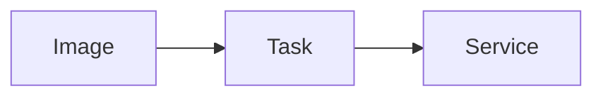

# ECS

Cloud · 15 min

ECS runs containers without you operating a Kubernetes control plane.

## Flow



## ECS

A task definition, a service, a target group. Less surface than EKS. Choose it when the team will not run Kubernetes. This project chooses EKS so the story matches the CKAD path and your OpenShift work. Saying why you did not choose ECS is the answer.

## Play this

1. Name it
2. Say the rule
3. Tie it to the project or a problem
4. One sentence from memory tomorrow

## Steps

- Read the rule once.
- Write the example from a blank file.
- Say the interview answer out loud.

## Example

```text
EKS for this repo. ECS if the team rejects the control plane.
```

## The usual miss

Running both for one demo.

## They will ask

Why EKS here instead of ECS?

## Before you close the laptop

Say the one reason.
