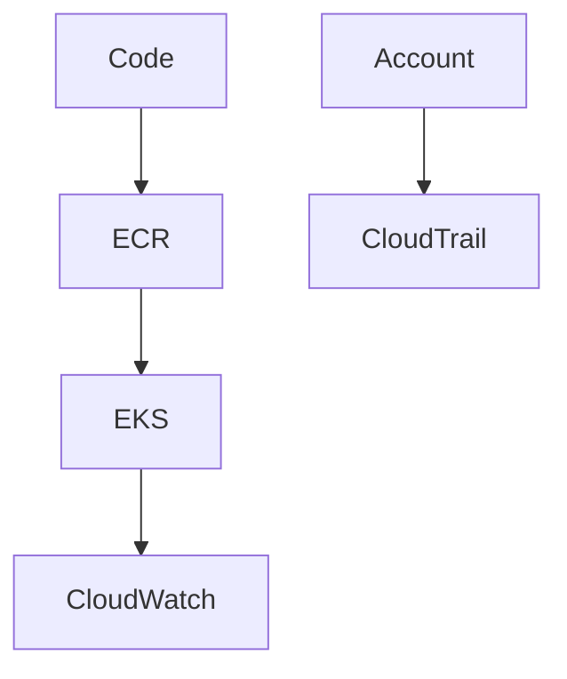

# EKS, images, and CloudWatch

Cloud · 35 min

EKS is Kubernetes with AWS as the cloud under it. You still need to understand pods. CloudWatch and CloudTrail tell you what the service and the account did.

## Flow



## What you deploy

The image is in ECR. EKS runs the Deployment. CloudWatch holds logs and metrics. CloudTrail holds API calls such as who changed a security group. Alarms fire on error rate and on disk. The agent reads the same metrics. You can describe this without having the production account on day one. A local cluster plus a diagram is an honest version of the story until the apply happens.

## Play this

1. Build an image
2. Push to ECR
3. Deploy to EKS
4. Logs and a trail

## Steps

- ECR stores the image. EKS runs it. IAM on the service account is how the pod calls AWS.
- CloudWatch for logs and metrics. An alarm on error rate and on disk.
- CloudTrail is the audit of API calls. Useful when someone changes a security group.

## Example

```text
You do not need Lambda, API Gateway, and Route53 in week one. Add them when the design needs them.
```

## The usual miss

Putting the AWS key in the container environment.

## They will ask

What is the difference between CloudWatch and CloudTrail?

## Before you close the laptop

Write the alarm you would want on the diagnostics agent: error rate and token cost.
